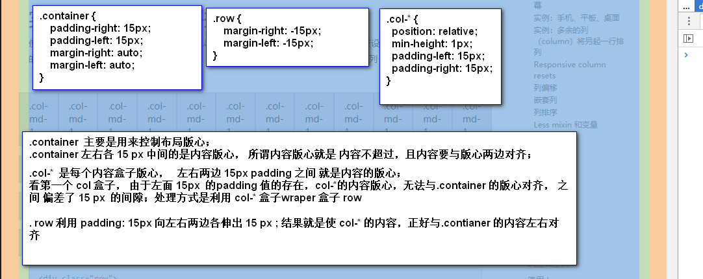
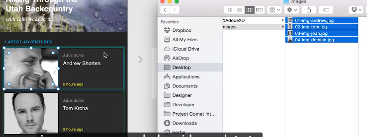
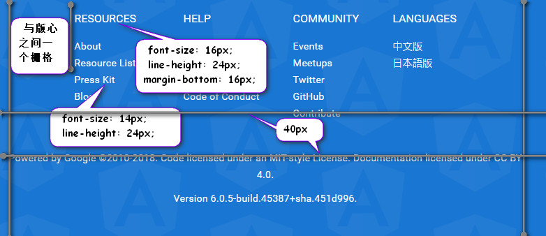

# XD

## layout 

> the splite of grid in app or website should based on the libray we use;

1. website bootstrap grid



* difference between the container and container-fluid 

```css

@media (min-width: 768px) {
  .container {
    width: 750px;
  }
}
@media (min-width: 992px) {
  .container {
    width: 970px;
  }
}
@media (min-width: 1200px) {
  .container {
    width: 1170px;
  }
}
.container-fluid {
  margin-right: auto;
  margin-left: auto;
  padding-left: 15px;
  padding-right: 15px;
}

```

* 实际的页面布局设置

width: 1920; height ： 1080px;
columns : 12; Gutter Width: 30; Column Width: 130; margin-left: 15; margin-right: 15px;

2. app ionic grid


> https://www.youtube.com/watch?v=gjNUwegxn1w

## panel

1. assets: we set asset panel with colors charactoer, styles, symbols that you can use repeatedly across your document and also edit them and the those particular elements will change right across your whole document . So you may have a hundred page and id you change one of the icons that were changed the color or the size or the shape of it across your the whole document.

* charactor 
    + charactor spacing : 字母之间的间距 对应 css : letter-spacing
    + line spacing:  line height property

2. layers 图层

## repeat grid
> https://www.youtube.com/watch?v=42VCB42TKp4

* 直接向左向右拖动
* 拖动间距， 调整块与块之间的margin 值 ；
* 填充图片的时候， 需要去留意 图片的命名顺序 (也可以在拖拽之前去选择多张图片， 然后一起拖过去（数量与块的数量要一致）， 主要就是利用多选的方式)



## 获取svg 

> https://www.youtube.com/watch?v=TyoFGyENt3g

* 从文件中去获取
* 从 adobe illustrator 中去获取

## hot key

1. 标尺工具： alt 键

2. 上移与下移动： 上下箭头 一次一个像素  shift + -> 一次10px 

3. 拖动复制: `alt + 鼠标拖动` 
    *  `shif + alt + 拖动` 精准拖动复制

4. 多选操作： Select multiple items across different groups
    + Shift+Click allows to select multiple items. 
    + Cmd+Click allows to select inside a group. 
    + Cmd+Shift+Click would be nice if it selected items across different groups.
    + It's very useful to change details (i.e. color) across multiple items inside groups (i.e. icons).
5. 框选操作： 可以进行多选，但是前提是 利用 图层lock 将 下面的 层 锁住， 防止在拖拽的时候， 下面会跟着鼠标错位；

## 画板选择

刚开始的时候，就应该去选择一个 1920 * 1080 的画板； 这样布局起来，才有参考的意义；

## 常见尺寸(具体的尺寸 可以去实际的参考 已建成的网站)

1. 轮播图的三个点 ： 点一般是10*10的 点与点之间的间距一般是10 opacity: 50% 当前的圆点透明度为 0%  bottom: 30px 


2. footer

* footer字体



footer 外层盒子的 上下 padding : 48px;
title 的 line-height : 24px  font-size: 16px
title 的 margin-bottom : 16px 

item 外层div height 24px line-height 24px
item 本身： font-size: 14px

3. 页面之间的分割线 

* 默认黑色
* 透明度 50%
* 线宽 0.5px

## color gradient

> https://www.youtube.com/watch?v=Dp_b1Foj4_o


## Using Photoshop and illustrator With Adobe XD

> https://www.youtube.com/watch?v=kz6cjeDQuU8

1. illustrator 中的矢量图 我们可以直接采用 ctrl+c 复制，然后在 XD 中粘贴的方式；

## create dash line in Adobe xd  

> 如何在 adobe xd 中 做 点画线  ， 主要使用 repeat grid  , 即 先去画一个点 或者画一个 矩形， 然后 再重复即可；

1. 点画线： 小圆 4*4  repeat margin 8 为圆形直径2倍
2. 细画线： 矩形 10*4 repeat margin  10 为 矩形等宽


If a module provides both providers and declarations (components, directive, pipe) then loading it in a child injector such as a route, would duplicate the provider instance. The duplication of providers would cause issure. For this reason Angular privodes a way to seperate providers out of the module so that same 

For this reason Angular provides a way to separate providers out of the modules so that same module can be imported in to the root module with providers and child modules without providers.

RouterModule needs to provide the Router service, as well as the RouterOutlet directive . RouterModule has to be imported by the root application module so that the application has a Router and the application has at leat on RouterOutlet . It also must be imported by the indivadual route components so that they 

A module that adds providers to the application can offer a facility for configuring those providers as


Import CoreModule and use its forRoot() one time , In AppModule, because it registers services and you only want to register those services one time in your app. If you 

```ts
// user.service.ts
constructor (@Optional() config: UserServiceConfig) {
  if (config) (
    this._userName = config.userName;
  )
}


static forRoot(config: UserServiceConfig): ModuleWithProviders {
  return {
    ngModule: CoreModule,
    providers: [
      {provider: UserServiceConfig, useValue: config}
    ]
  }
}

import { CoreModule } from './core/core.module';

@NgModule({
  imports: [
    BrowserModule,
    ContactModule,
    CoreModule.forRoot({
      userName: 'Miss Marple'
    })
  ]
})

// By default , the injector throw an error when it can't find a requested provider , 

Angular creates 

```


Angular creates a lazy-loaded module with its own injector, a child of the root injetor. @SkipSelf causes Angular to look for a CoreModule in the parent injector, which is the root injector . Of course it finds the 


An NgModule describes how the application parts fit together. Every application has at least one Angulae module, the root module that you bootstrap to launch the application. By convention , it's usually called AppModule.

The @NgMoudle decorator identifies AppModule as an NgModule calls . @NgModule takes a metadata object that tells Angular how to compile and launch the application.


A provider is an instruction to the DI system on how to obtain a value for a dependency. Most of the time , these dependencies are services that you create and provide.


